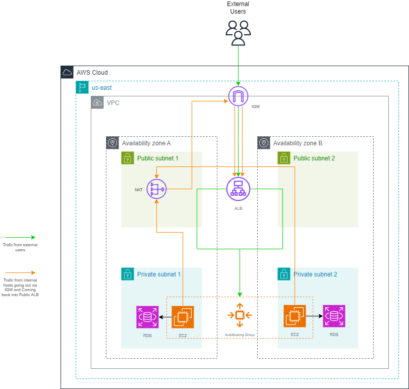

# AWS Infrastructure Deployment with Terraform

## Overview
This Terraform configuration deploys the following AWS infrastructure:
- A VPC with a public and a private subnet in two availability zones.
- An Internet Gateway attached to the VPC.
- An Application Load Balancer (ALB) with a security group.
- An Auto Scaling Group (ASG) with EC2 instances running an application.
- An RDS instance for database storage, located in a private subnet.



## AWS Well-Architected Framework Considerations
### Operational Excellence
In this aspect, I have used Terraform as Infrastructure as Code (IaC), which allows me to have version control, deploy automatically, and repeat  the process. Additionally, I can ensure that the application can manage variable changes efficiently.

### Security
EC2 instances are created in a private subnet, which ensures they cannot be accessed directly from the internet. Only the ALB exposes port 80 to the internet, and the RDS instances can be accessed from within the VPC.

### Reliability
Using an auto-scaling group ensures high availability by automatically launching replacement instances if an EC2 fails. The ALB distributes traffic across the scaling group.

### Performance Efficiency
Auto-scaling automatically creates the number of EC2 instances depending on the application's load. This configuration is designed to balance the load and ensure efficient resource usage.

### Cost Optimization
Resources are created on-demand and scale automatically, which means you only pay for what you use. Using Terraform helps create these resources efficiently and minimizes creating unnecessary resources.

## Deployment Instructions
1. **Configure AWS Credentials:**
   Ensure you have your AWS credentials configured either by using AWS CLI (`aws configure`) or by setting environment variables:
   ```bash
   export AWS_ACCESS_KEY_ID="your_access_key_id"
   export AWS_SECRET_ACCESS_KEY="your_secret_access_key"
   export AWS_DEFAULT_REGION="your_aws_region"
2. **Deploy:**
   Run Terraform commands:
   ```bash
   terraform init
   terraform plan
   terraform apply

## CI/CD
### CI/CD Pipeline Definition
A CI/CD pipeline is a series of automated steps that take your application's code and deploy it to your server.

### Stages Involved
- **Source**: Pull the latest code from GitHub.
- **Test**: Run integration tests to validate the application.
- **Security**: Run SonarQube for vulnerabilities in the application.
- **Build**: Compile the code, create a tag, create the docker image, and save the docker image in a registry.
- **Deploy**: Validate that the application is working with a smoke test, download the image docker from registry and deploy the application to AWS using AWS GitHub Actions.
- **Monitor**: This is not part of a pipeline, but use a monitoring tool to validate that the application is working.
 
### Integration Points with AWS Services
- **GitHub Actions**: Source control for the application code.
- **GitHub Actions**: Building and testing the application.
- **GitHub Actions**: Deploying the application to EC2 instances.
- **Terraform or CDK**: Managing infrastructure as code.
- **DataDog**: Monitoring application performance and health.

